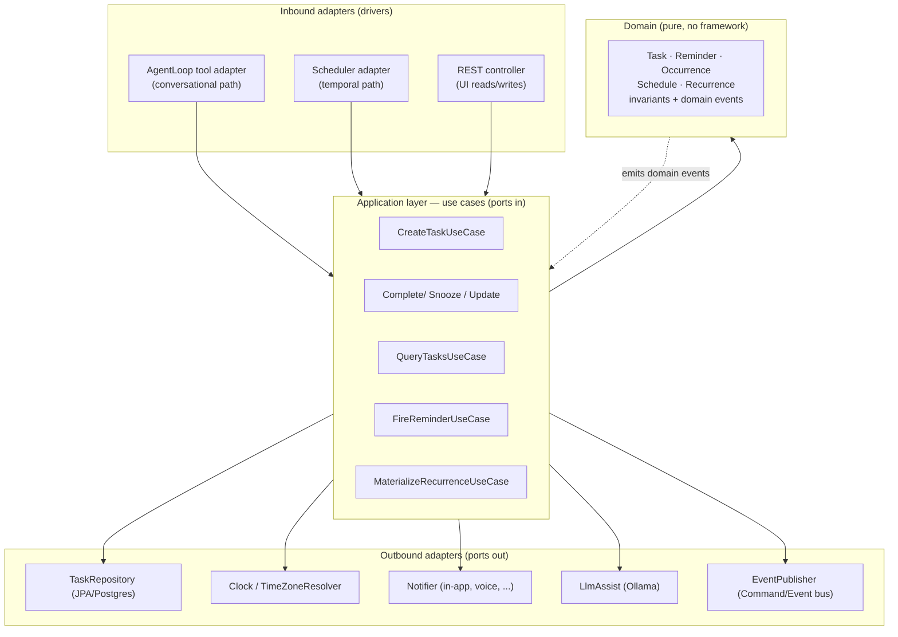
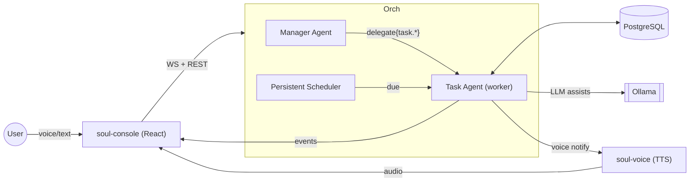
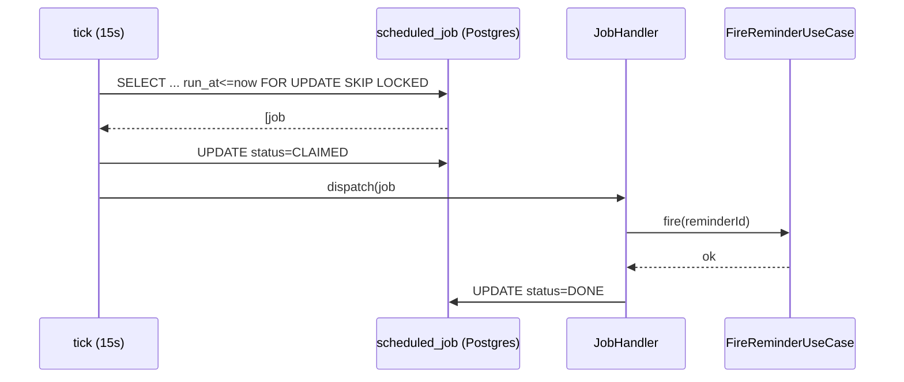
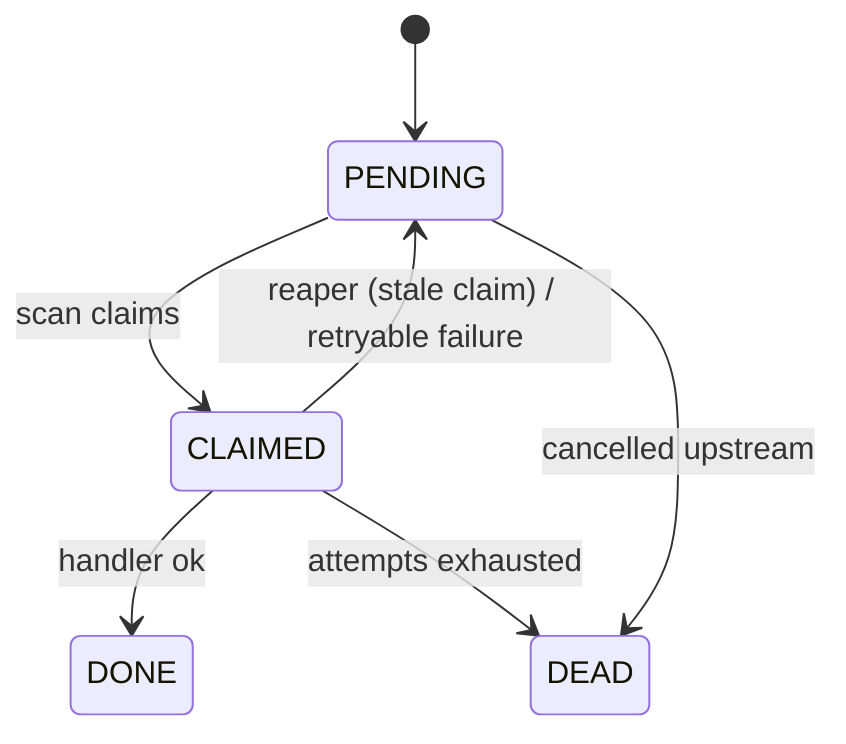
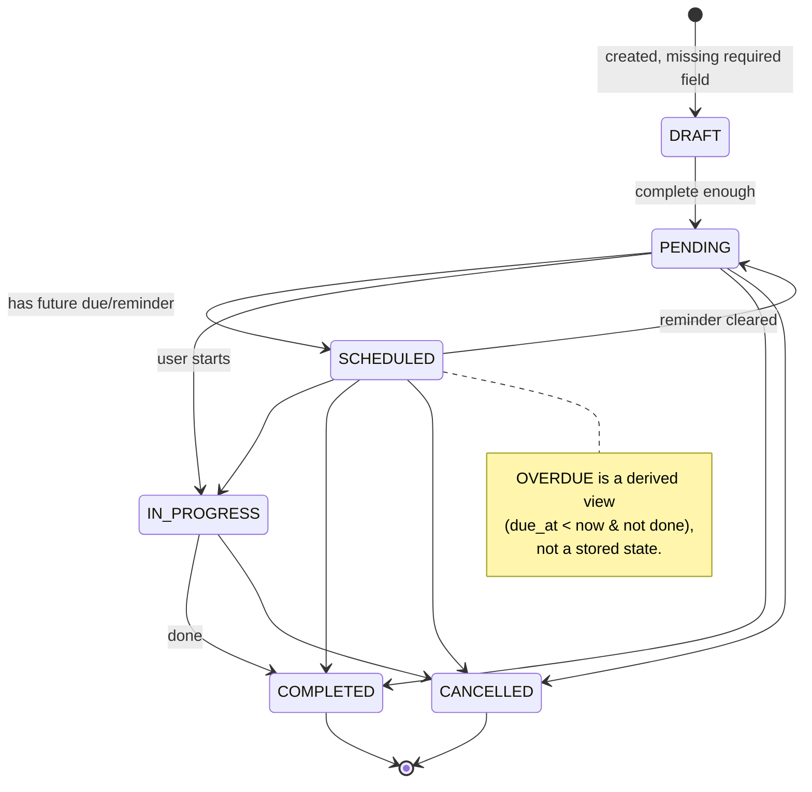
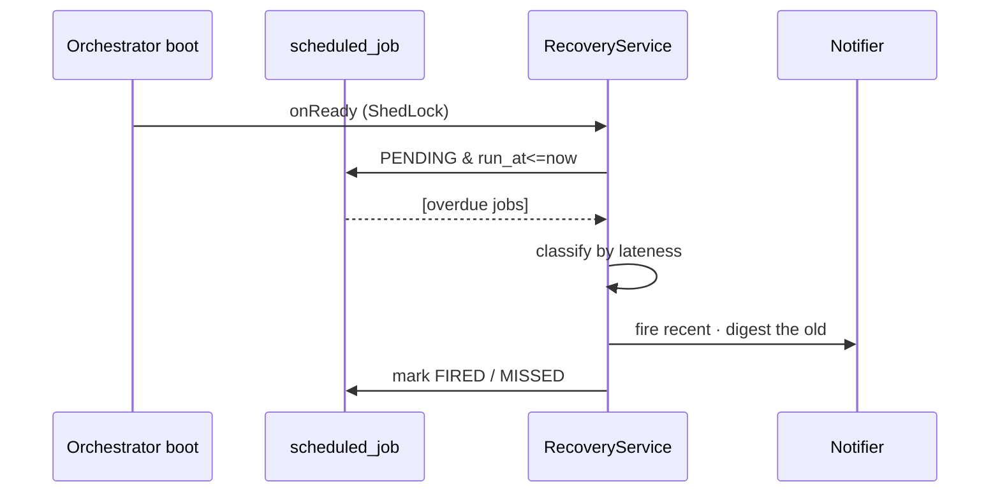
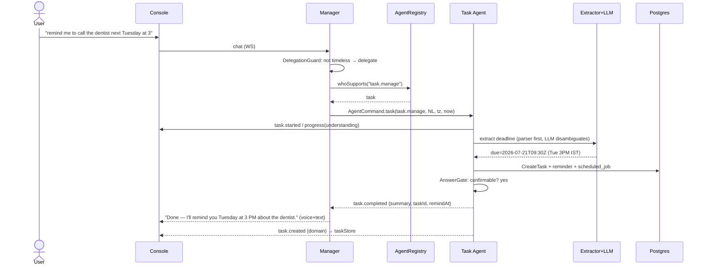
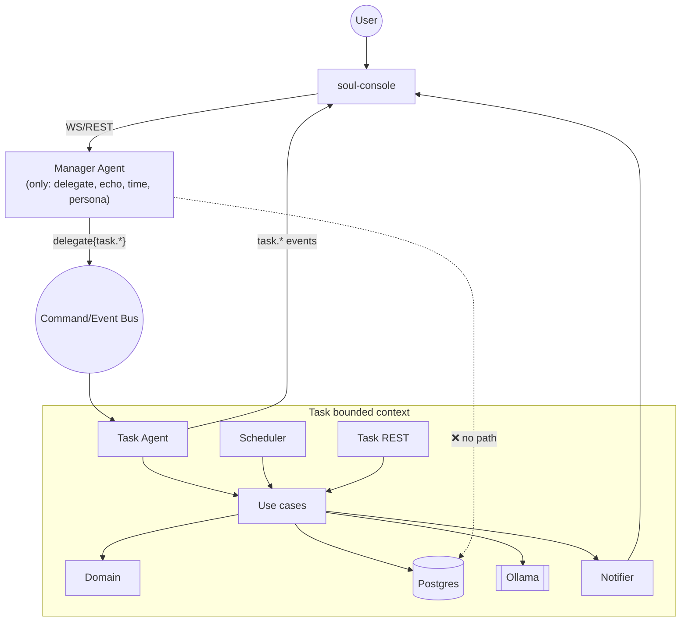
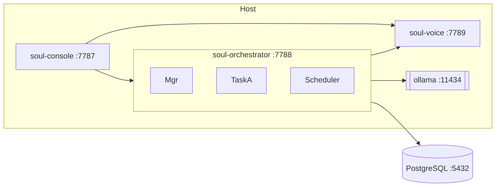
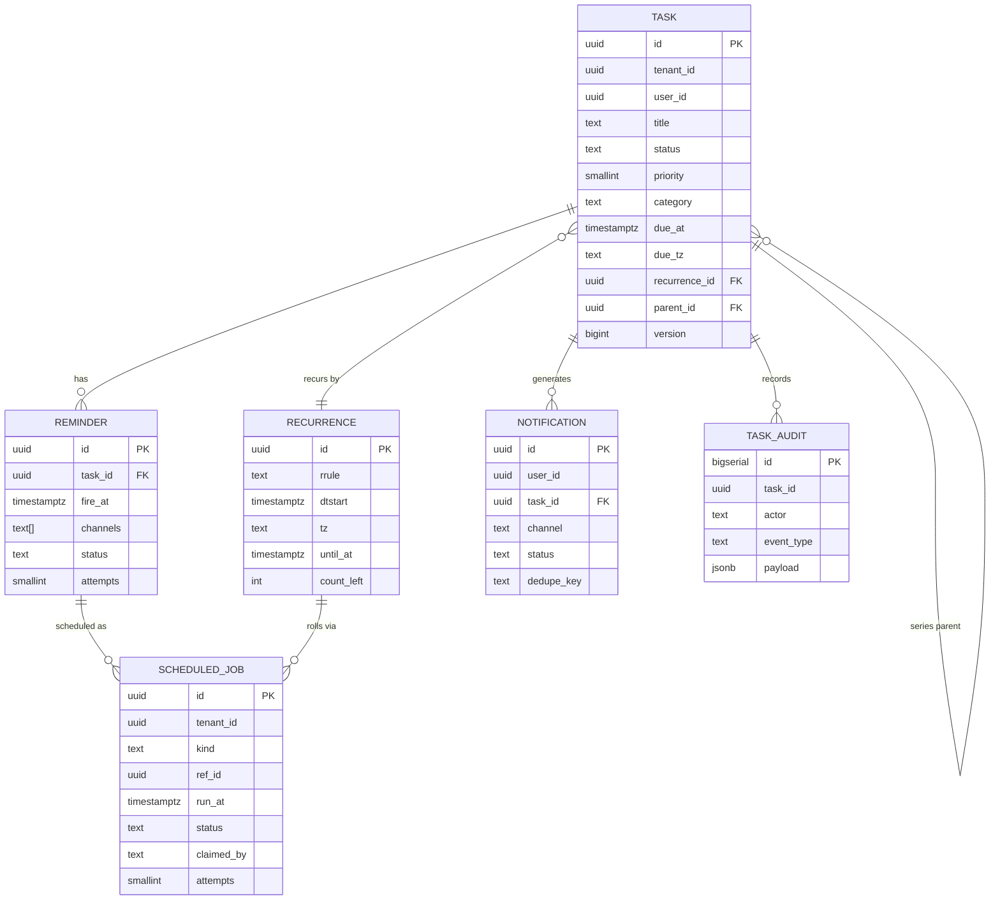

# SOUL — Task Agent: Technical Specification

> Status: **design** — for review before implementation.
> Audience: the engineering team implementing SOUL's second worker agent.
> Companion docs: [`researcher-agent.md`](researcher-agent.md) (the Command/Event protocol
> and `AgentLoop` this builds on), [`SPEC.md`](SPEC.md) (system overview).

The Researcher proved the worker pattern for a **stateless, request/response** capability.
The Task Agent is the first worker that is **stateful, persistent, and time-driven**: it
owns tasks, reminders, and schedules that must survive restarts and fire on their own,
with no user in the loop. This document specifies it end to end.

---

## 0. Grounding — what exists today, and what this feature adds

This spec is written against the **real** codebase, not an idealized one. Three honest
notes so the team isn't surprised:

| The context brief says | Reality in the repo today | This spec's stance |
| --- | --- | --- |
| "PostgreSQL" | No database exists. State is in-memory (`ConversationStore`). | **The Task Agent introduces PostgreSQL** — it is the first component that cannot be stateless. Flyway + JPA, additive to the stack. |
| "Python Worker Agents" | The one worker (`ResearcherWorker`) is a **Java** in-process component running the shared `AgentLoop`; its *skills* are Python subprocesses (`skillpool/*/run.py`). | The Task Agent follows the **proven Java worker pattern** (reuses `AgentLoop`, Spring's scheduler, JPA). The **worker is defined by its capabilities and the Command/Event contract, not its language** (§3.6) — so it can be extracted to a standalone Python/other process later without touching the Manager. |
| "Manager must never manipulate tasks" | Already structurally true: the Manager holds only the generic `delegate{capability, task}` tool; capabilities are owned by whoever registers them. | We **keep** this invariant and make it explicit and testable (§2.3). |

Everything below reuses machinery that already exists — `AgentCommand`/`AgentEvent`,
`AgentRegistry.whoSupports`, `PendingDelegations.dispatchAndAwait`, `DelegateTool`,
`AgentLoop`/`LoopSpec`, `EventSink`/WebSocket bridge, the `skillpool`/`hookspool` model,
and the deterministic confidence policy. New machinery (persistence, scheduler, proactive
notifications) is called out as such.

---

## 1. Overview

### 1.1 What it is

The Task Agent is SOUL's **task-management bounded context**: a worker agent that turns
natural-language requests ("remind me to call the dentist next Tuesday at 3", "what's due
this week?", "push everything after my flight") into durable, scheduled, observable tasks —
and then fires reminders and notifications at the right time, in the right timezone, even
after a crash or a week of downtime.

### 1.2 Two entry points, one domain core

The single most important architectural idea: the Task Agent has **two independent drivers**
over **one domain core**.

```
   Conversational path (reactive)          Temporal path (proactive)
   Manager --delegate--> Task Agent        Scheduler tick --> due reminders
        (natural language)                     (wall-clock time)
                \                               /
                 \                             /
                  v                           v
            ┌─────────────────────────────────────┐
            │   Application layer (use cases):     │
            │   CreateTask, CompleteTask, Snooze,  │
            │   SetReminder, QueryTasks, ...       │
            └─────────────────────────────────────┘
                              │
                              v
            ┌─────────────────────────────────────┐
            │   Domain: Task, Reminder, Schedule,  │
            │   Recurrence, invariants             │
            └─────────────────────────────────────┘
                              │
                    Postgres · Ollama · Bus
```

The conversational path is what the Researcher already does (delegation → `AgentLoop` →
tools → completion). The temporal path is **new**: a persistent scheduler that wakes on its
own and drives the *same* application use-cases. Neither path knows about the other; both go
through the same invariant-guarding domain.

### 1.3 Design tenets

- **Clean Architecture** — dependencies point inward. Domain knows nothing of Postgres, the
  bus, or Ollama. Application use-cases depend on *ports* (interfaces); infrastructure
  provides *adapters*. The agent loop and the scheduler are two inbound adapters; the
  repository, clock, notifier, and LLM are outbound adapters.
- **DDD** — Task Agent is a bounded context with its own ubiquitous language (Task, Reminder,
  Occurrence, Schedule). The Manager talks to it only across the published contract
  (capabilities + Commands/Events) — an anti-corruption boundary.
- **Event-Driven** — all cross-boundary facts are events. Task state changes emit domain
  events; those fan out to the UI, the notifier, and the audit log. No component polls
  another's database.
- **SOLID** — every engine (scheduler, reminder, notification, recurrence, NLP extractors)
  is a single-responsibility component behind an interface, wired by Spring, open for
  extension (new channels, new recurrence rules) without modifying callers.

---

## 2. Responsibilities

### 2.1 In scope (v1)

1. **CRUD + lifecycle** of tasks: create, read, update, complete, cancel, delete, snooze.
2. **Reminders**: one-shot and recurring, timezone-correct, delivered via one or more
   channels (in-app, voice, and an extensible set).
3. **Scheduling**: durable time triggers that survive restarts and recover missed windows.
4. **Recurrence**: RRULE-style repeating tasks with materialized next-occurrence logic.
5. **Natural-language understanding** of task requests (deadline extraction, categorization,
   priority) via Ollama, always behind deterministic guards.
6. **Proactive notification** including the **voice notification flow** (SOUL speaks a due
   reminder aloud).
7. **Query & summarization**: "what's due today", "summarize my overdue tasks".
8. **AI assists** (§15): prioritization, summarization, deadline extraction, auto-categorize,
   conflict detection, smart suggestions.

### 2.2 Out of scope (v1)

- Calendar/email sync (designed for in §28, not built).
- Collaborative/shared tasks between users (multi-tenant *readiness* only — §23).
- Sub-tasks / dependencies graph (schema leaves room; engine is flat in v1).
- Mobile push (channel interface supports it; only in-app + voice implemented).

### 2.3 The hard invariant — the Manager never touches tasks

The Manager (`super`) is offered exactly one delegation tool, generated from the registry.
It has **no** task skills, **no** database access, **no** knowledge of the task schema. Every
task operation is a delegation across the capability boundary. This is enforced three ways:

1. **Structurally** — task capabilities (`task.manage`, `task.query`) are registered *only*
   by the Task Agent. `DelegateTool` routes by `AgentRegistry.whoSupports(capability)`; there
   is no code path from the Manager to a task repository.
2. **By configuration** — `soul.agents.super.skills` contains no task skill; the Manager's
   toolbox is `echo`, `current-time`, `persona`, plus the generic `delegate`.
3. **By test** — an architecture test (ArchUnit) asserts no type under `agent.task..` is
   reachable from `ManagerAgent`, and an integration test asserts the Manager cannot mutate a
   task except through a `task.*` delegation event (§29).

---

## 3. Architecture

### 3.1 Component view (Clean Architecture layers)



Rule: arrows only point inward or to a port interface. The domain has **zero** imports from
Spring, JPA, Jackson, or Ollama. Use-cases orchestrate the domain and speak to ports. Adapters
are the only place frameworks appear.

### 3.2 Where it runs

The Task Agent is a Spring module inside `soul-orchestrator` (package
`com.soul.orchestrator.agent.task`), registered as a worker at startup exactly like
`ResearcherWorker`. This reuses:

- the in-process `CommandBus`/`EventBus` and `AgentRegistry`,
- Spring's `@Scheduled` / `ThreadPoolTaskScheduler` and `ShedLock` for the durable scheduler,
- Spring Data JPA + Flyway for Postgres,
- the existing `EventSink` → WebSocket bridge.

Because the boundary is the protocol (§3.6), extraction to a standalone service is a
deployment change, not a redesign.

### 3.3 System context



### 3.4 Package layout

```
com.soul.orchestrator.agent.task
├── domain/                # pure: Task, Reminder, Occurrence, Recurrence, Priority, TaskStatus
│   ├── model/
│   ├── event/             # TaskCreated, TaskCompleted, ReminderDue, ... (domain events)
│   └── policy/            # RecurrenceRule, RetryPolicy, ConflictPolicy (pure logic)
├── application/           # use cases + port interfaces
│   ├── port/in/           # CreateTask, CompleteTask, QueryTasks, FireReminder, ...
│   ├── port/out/          # TaskRepository, Clock, Notifier, LlmAssist, EventPublisher
│   └── service/           # use-case implementations
├── adapter/
│   ├── in/agent/          # TaskAgentWorker + tool definitions (AgentLoop bridge)
│   ├── in/scheduler/      # DueScanScheduler, ShedLock config
│   ├── in/web/            # TaskController (REST for UI)
│   ├── out/persistence/   # JPA entities, Spring Data repos, mappers
│   ├── out/notify/        # InAppNotifier, VoiceNotifier, NotificationRouter
│   └── out/llm/           # OllamaLlmAssist (wraps existing OllamaClient)
└── config/                # TaskAgentProperties, bean wiring
```

---

## 4. Agent Loop

The Task Agent runs the **same** `AgentLoop` as the Researcher (`LoopSpec.forAgent("task")`).
It is not a new loop — it is the generalized one, given task tools instead of research tools.

### 4.1 Loop configuration

```java
LoopOutcome outcome = loop.run(LoopSpec.forAgent("task")
    .conversation(command.conversationId())
    .text(taskOf(command))                       // the NL request from the Manager
    .history(List.of(ChatMessage.user(prompt(command))))
    .cancelledWhen(() -> cancellation.isCancelled(command.id()))
    .observedBy(narrator)                         // stages: understanding → acting → confirming
    .answerGate(gate::mustConfirmMutations)       // see §4.3
    .builtins(taskTools.forCommand(command))      // the Task Agent's private toolbox
    .build());
```

### 4.2 Tools (the worker's private skills)

These are **not** exposed to the Manager — they are the Task Agent model's toolbox, the same
way `web-search`/`fetch-page` are the Researcher's. Each maps 1:1 to an application use-case,
so the model never touches the repository directly.

| Tool | Use-case | Notes |
| --- | --- | --- |
| `create_task` | `CreateTaskUseCase` | title, notes, due, priority?, category?, recurrence?, reminders[] |
| `update_task` | `UpdateTaskUseCase` | partial; by id |
| `complete_task` | `CompleteTaskUseCase` | idempotent; advances recurrence |
| `cancel_task` / `delete_task` | lifecycle | soft-cancel vs hard-delete |
| `snooze_reminder` | `SnoozeReminderUseCase` | relative or absolute |
| `set_reminder` | `SetReminderUseCase` | attach reminder to task |
| `list_tasks` | `QueryTasksUseCase` | filter: status, due range, category, priority, text |
| `summarize_tasks` | `SummarizeUseCase` | LLM assist (§15.2) |

Whether the model *uses tools* or the app pre-parses is deliberately layered: a **deterministic
extractor** (§15.3) runs first on the raw request to pull structured fields (dates, priority),
and the tool call carries both the NL and the extracted struct. The model composes and
disambiguates; the extractor guarantees the date parsing isn't hallucinated (same philosophy as
the Researcher's evidence caps — move guarantees from prose into code).

### 4.3 The AnswerGate — confirm before mutating

Reusing the `AnswerGate` seam (`vet(answer) → null | nudge`). For the Task Agent it enforces a
different rule than the Researcher's "read enough sources": **a mutation must be reflected back
to the user in confirmable terms before the loop reports success.** If the model completed a
`create_task` but its answer doesn't state *what* it created and *when* it will remind, the gate
nudges it once to produce a confirmable sentence. This is what makes voice interaction safe —
the user hears "Done — I'll remind you Tuesday at 3 PM about the dentist," never a silent write.

### 4.4 Streaming vs. non-streaming

Like the Researcher, the Task Agent **does not stream** to the user directly (only the Manager
streams). Its "answer" is the `TaskResult` payload of `task.completed`; the Manager summarizes
it in SOUL's voice. This keeps one voice to the user and lets the gate veto without the user
having already heard a wrong answer.

---

## 5. Command/Event Protocol

### 5.1 Capabilities registered

At `@PostConstruct`, following `ResearcherWorker.register()`:

```java
registry.register(
    new AgentDescriptor("task",
        "manages the user's tasks, reminders and schedules: create, update, complete, "
      + "snooze, and answer questions about what is due. Use for anything the user wants "
      + "to be reminded of or track over time.",
        Set.of("task.manage", "task.query")),
    this::onCommand);
```

Two capabilities, mirroring the read/write split the Researcher established
(`research.search`/`research.fetch`):

- **`task.manage`** — any mutation (create/update/complete/snooze/cancel/schedule).
- **`task.query`** — read-only questions ("what's due", "how many overdue").

The Manager's generated `delegate` description gains these automatically — no Manager code
changes. The `DelegationGuard` (from the latency fix) already answers timeless facts directly;
task requests carry recency/imperative signals and route correctly.

### 5.2 Inbound commands

`AgentCommand.task("super", "task", conversationId, payload)` where `payload` is:

```json
{
  "capability": "task.manage",
  "task": "remind me to call the dentist next Tuesday at 3pm",
  "attempt": 1,
  "userId": "u_123",
  "userTimeZone": "Asia/Kolkata",
  "nowInstant": "2026-07-20T09:15:00Z"
}
```

`userTimeZone` and `nowInstant` are injected by an `inject-time`-style hook (§20) so the agent
never guesses "now" or the zone. Cancellation reuses `AgentCommand.cancel(...)` → the
`CancellationRegistry`, exactly as today.

### 5.3 Outbound lifecycle events (unchanged protocol)

The **five** `task.*` `AgentEvent` types are reused verbatim — this is the whole point of the
worker-agnostic protocol:

| Event | When | Payload highlights |
| --- | --- | --- |
| `task.started` | delegation accepted | — |
| `task.progress` | staged narration | `stage`: `understanding`/`acting`/`confirming`, `label` |
| `task.completed` | delegation done | `TaskResult`: confidence, summary, `data.taskId`, `data.reminders` |
| `task.failed` | couldn't do it | `reason` |
| `task.cancelled` | user stopped it | — |

`TaskResult.confidence` here means *"how sure am I I understood the request"* — a low-confidence
parse (ambiguous date) is hedged or bounced back for confirmation via the same policy machinery.

### 5.4 New: domain events (internal) and proactive notifications

Two additions that do **not** change the existing protocol:

1. **Domain events** (`TaskCreated`, `TaskCompleted`, `ReminderDue`, `ReminderFired`,
   `OccurrenceRolled`) — published on the internal `EventBus`, consumed by the notifier,
   the UI projector, and the audit log. These are *domain* facts, distinct from the *agent
   lifecycle* `task.*` events.
2. **Proactive `NotificationEvent`** (§10) — user-scoped, **not** conversation-scoped, because
   a reminder fires with no conversation in flight. This needs a new user-scoped WS route
   (§14.3); the existing bridge routes on `conversationId` only.

```mermaid
flowchart LR
    subgraph Agent lifecycle (exists)
        C[AgentCommand.task] --> W[Task Agent]
        W --> E1[task.started/progress/completed]
    end
    subgraph Domain (new, internal)
        W --> D[TaskCreated / ReminderDue]
        SCHED[Scheduler] --> D
    end
    D --> N[NotificationRouter]
    N --> WS[(user-scoped WS)]
    N --> V[voice]
```

---

## 6. Database Schema

PostgreSQL, managed by **Flyway** (`V1__task_agent.sql`). All timestamps are `timestamptz`
(stored UTC). Every table carries `tenant_id` and `user_id` from day one (§23) even though v1
is single-tenant — retrofitting a tenant key is a migration nightmare; carrying an unused one
is free.

### 6.1 DDL (abridged)

```sql
CREATE TABLE task (
    id            UUID PRIMARY KEY DEFAULT gen_random_uuid(),
    tenant_id     UUID NOT NULL,
    user_id       UUID NOT NULL,
    title         TEXT NOT NULL,
    notes         TEXT,
    status        TEXT NOT NULL DEFAULT 'PENDING',      -- see §17
    priority      SMALLINT NOT NULL DEFAULT 2,          -- 0 highest .. 4 lowest
    category      TEXT,
    due_at        TIMESTAMPTZ,                          -- UTC; null = someday
    due_tz        TEXT,                                 -- IANA zone the user meant
    recurrence_id UUID REFERENCES recurrence(id),
    parent_id     UUID REFERENCES task(id),             -- recurrence instances / subtasks
    source        TEXT NOT NULL DEFAULT 'agent',        -- agent | rest | recurrence
    created_at    TIMESTAMPTZ NOT NULL DEFAULT now(),
    updated_at    TIMESTAMPTZ NOT NULL DEFAULT now(),
    completed_at  TIMESTAMPTZ,
    version       BIGINT NOT NULL DEFAULT 0,            -- optimistic lock
    CONSTRAINT chk_priority CHECK (priority BETWEEN 0 AND 4)
);
CREATE INDEX idx_task_user_status ON task(tenant_id, user_id, status);
CREATE INDEX idx_task_due ON task(status, due_at) WHERE status IN ('PENDING','SCHEDULED');

CREATE TABLE recurrence (
    id          UUID PRIMARY KEY DEFAULT gen_random_uuid(),
    rrule       TEXT NOT NULL,           -- RFC-5545 RRULE
    dtstart     TIMESTAMPTZ NOT NULL,
    tz          TEXT NOT NULL,           -- recurrence is evaluated in this zone (§20)
    until_at    TIMESTAMPTZ,
    count_left  INTEGER
);

CREATE TABLE reminder (
    id          UUID PRIMARY KEY DEFAULT gen_random_uuid(),
    task_id     UUID NOT NULL REFERENCES task(id) ON DELETE CASCADE,
    fire_at     TIMESTAMPTZ NOT NULL,    -- UTC instant this reminder is due
    lead_label  TEXT,                    -- "1 day before", "at time" (for UI)
    channels    TEXT[] NOT NULL DEFAULT '{in_app}',   -- in_app | voice | push ...
    status      TEXT NOT NULL DEFAULT 'PENDING',      -- PENDING|FIRED|MISSED|CANCELLED
    fired_at    TIMESTAMPTZ,
    attempts    SMALLINT NOT NULL DEFAULT 0,
    next_retry_at TIMESTAMPTZ,
    version     BIGINT NOT NULL DEFAULT 0
);
CREATE INDEX idx_reminder_due ON reminder(status, fire_at);

-- The durable job ledger the scheduler scans (§7). One row per "thing to do at a time".
CREATE TABLE scheduled_job (
    id            UUID PRIMARY KEY DEFAULT gen_random_uuid(),
    tenant_id     UUID NOT NULL,
    kind          TEXT NOT NULL,              -- REMINDER | RECURRENCE_ROLL | ESCALATION
    ref_id        UUID NOT NULL,              -- reminder.id or recurrence.id
    run_at        TIMESTAMPTZ NOT NULL,
    status        TEXT NOT NULL DEFAULT 'PENDING',   -- PENDING|CLAIMED|DONE|DEAD
    claimed_by    TEXT,                       -- node id (multi-instance safety)
    claimed_at    TIMESTAMPTZ,
    attempts      SMALLINT NOT NULL DEFAULT 0,
    last_error    TEXT,
    created_at    TIMESTAMPTZ NOT NULL DEFAULT now()
);
CREATE INDEX idx_job_due ON scheduled_job(status, run_at);

CREATE TABLE notification (
    id          UUID PRIMARY KEY DEFAULT gen_random_uuid(),
    tenant_id   UUID NOT NULL,
    user_id     UUID NOT NULL,
    task_id     UUID REFERENCES task(id) ON DELETE SET NULL,
    channel     TEXT NOT NULL,
    body        TEXT NOT NULL,
    status      TEXT NOT NULL DEFAULT 'PENDING',   -- PENDING|SENT|DELIVERED|FAILED|SUPPRESSED
    dedupe_key  TEXT,                              -- idempotency (§21)
    created_at  TIMESTAMPTZ NOT NULL DEFAULT now(),
    sent_at     TIMESTAMPTZ,
    UNIQUE (tenant_id, dedupe_key)
);

CREATE TABLE task_audit (
    id         BIGSERIAL PRIMARY KEY,
    tenant_id  UUID NOT NULL,
    task_id    UUID,
    actor      TEXT NOT NULL,          -- agent | scheduler | rest:user | system
    event_type TEXT NOT NULL,
    payload    JSONB NOT NULL,
    at         TIMESTAMPTZ NOT NULL DEFAULT now()
);
```

### 6.2 Why a separate `scheduled_job` ledger

Reminders and recurrence rolls could be computed on the fly, but a durable job table is what
makes **persistent scheduling** (§8) and **missed-reminder recovery** (§21) tractable: the
scheduler has exactly one thing to scan, claiming is atomic, and "what should have fired while
we were down" is a single indexed query (`status='PENDING' AND run_at <= now()`).

---

## 7. Scheduler Design

### 7.1 The claim-scan loop

A single Spring bean, `DueScanScheduler`, runs a **poll-and-claim** loop (default every 15 s,
`@Scheduled(fixedDelayString="${soul.task.scheduler.scan-interval-ms:15000}")`):

```
every tick:
  jobs = SELECT ... FROM scheduled_job
         WHERE status='PENDING' AND run_at <= now()
         ORDER BY run_at
         LIMIT :batch
         FOR UPDATE SKIP LOCKED          -- atomic claim, multi-instance safe
  mark CLAIMED (claimed_by=nodeId, claimed_at=now())
  for each job: dispatch to handler by kind → FireReminder / RollRecurrence / Escalate
  on success: status=DONE   on failure: retry policy (§18) → run_at bumped or DEAD
```

`FOR UPDATE SKIP LOCKED` is the crux: two orchestrator instances can run the scan
simultaneously and never double-fire — Postgres hands each row to exactly one claimant.

### 7.2 Why poll, not in-memory timers

An in-JVM `ScheduledExecutorService` timer is lost on restart and invisible to a second
instance. The DB-backed poll is **durable, observable, and horizontally safe**. 15 s latency
on a reminder is imperceptible; the interval is configurable down to 1 s if needed. For
sub-second precision (not a task-reminder need) a hybrid "next-wake hint" can be added later —
noted, not built.

### 7.3 Distributed safety

`FOR UPDATE SKIP LOCKED` handles concurrent scans. **ShedLock** additionally guards the
*recurrence-materialization* sweep (a periodic job that must run once cluster-wide) so we
don't create duplicate occurrences. Node identity is the container hostname.



---

## 8. Persistent Scheduling

- **Durability**: every future action is a `scheduled_job` row. Nothing lives only in memory.
  A reminder set for 6 months out survives any number of restarts.
- **Idempotency**: firing checks the reminder's `status` before acting and writes
  `notification.dedupe_key = reminder.id + ':' + fire_at` under a unique constraint — a job
  replayed after a crash mid-flight cannot double-notify.
- **Claiming**: `CLAIMED` rows carry `claimed_at`; a **reaper** returns jobs `CLAIMED` longer
  than `claim-timeout` (default 2 min) back to `PENDING` (the claimant died mid-job). Combined
  with idempotency, at-least-once delivery becomes effectively-once.
- **Backpressure**: batch size bounds work per tick; overload spreads across ticks rather than
  spiking.

State machine for a `scheduled_job`:



---

## 9. Reminder Engine

### 9.1 Responsibility

Translate a task's reminder intents into `scheduled_job` rows, and — when a job fires — decide
*whether it is still relevant* and hand a `NotificationRequest` to the Notification Engine.

### 9.2 Firing logic (`FireReminderUseCase`)

```
fire(reminderId):
  r = load(reminderId)
  if r.status != PENDING: return            # idempotent / already handled
  t = load(r.task_id)
  if t.status in (COMPLETED, CANCELLED):     # task done before reminder → suppress
      r.status = CANCELLED; return
  if now - r.fire_at > staleness_window:     # very late → missed-recovery path (§21)
      handleMissed(r, t); return
  notification = buildNotification(t, r)     # channels from r.channels
  notifier.route(notification)               # §10
  r.status = FIRED; r.fired_at = now
  publish(ReminderFired)
  if t.recurrence_id: enqueueRecurrenceRoll(t)   # §16
```

### 9.3 Lead times & multiple reminders

A task may have several reminders ("1 day before" + "at time"). Each is its own `reminder`
row and `scheduled_job`. Lead labels are computed at set-time in the user's zone so DST shifts
don't drift them (§20).

---

## 10. Notification Engine

### 10.1 Router + channels (Strategy + Open/Closed)

```java
interface NotificationChannel {
    String id();                                  // "in_app", "voice", "push"
    boolean supports(NotificationRequest r);
    DeliveryResult deliver(NotificationRequest r);
}
```

`NotificationRouter` fans a request to every channel named on the reminder, records a
`notification` row per channel, and applies **dedupe** (unique `dedupe_key`) and
**quiet-hours/rate** policy. Adding SMS later = new `NotificationChannel` bean; the router and
engine don't change (Open/Closed).

### 10.2 v1 channels

- **`InAppNotifier`** → emits a user-scoped `NotificationEvent` over WebSocket (§14.3); the
  console renders a toast + adds to a notification center.
- **`VoiceNotifier`** → the voice flow (§11).

### 10.3 Delivery states & dedupe

`PENDING → SENT → DELIVERED | FAILED | SUPPRESSED`. `DELIVERED` requires a client ack
(§21.3) for reminders that matter; `SUPPRESSED` covers quiet-hours or an already-completed
task. `dedupe_key` makes re-delivery after a crash a no-op.

---

## 11. Voice Notification Flow

The distinctive feature: SOUL **speaks** a due reminder — but only when it's safe and wanted.

### 11.1 Constraints unique to voice

- The user may not be at the machine. Voice is **best-effort** and always paired with an
  in-app notification (the durable record).
- SOUL must not talk over herself or the user. If a conversation/TTS is in flight, the voice
  reminder **queues** behind it.
- Barge-in echo is already handled (`selfEcho.ts`); a spoken reminder feeds the same
  self-echo buffer so it can't wake the mic.

### 11.2 Flow

```mermaid
sequenceDiagram
    participant S as Scheduler
    participant RE as ReminderEngine
    participant NR as NotificationRouter
    participant VN as VoiceNotifier
    participant WS as user WS channel
    participant C as Console
    participant TTS as soul-voice

    S->>RE: job due (reminder r)
    RE->>NR: route(notification: in_app + voice)
    NR->>WS: NotificationEvent (in_app)  %% durable, always
    C-->>C: toast + notification center
    NR->>VN: deliver(voice)
    VN->>WS: notify.voice {text, taskId}
    C->>C: presence/idle & TTS-free? 
    alt user present & audio idle
        C->>TTS: synthesize(text)
        TTS-->>C: audio
        C-->>C: speak; note in self-echo buffer
        C->>WS: notify.ack {id, spoken:true}
    else busy / away
        C->>WS: notify.ack {id, spoken:false, reason}
    end
```

### 11.3 Presence & consent

The console decides whether to actually speak, based on: `voiceMode !== 'off'`, a recent
user-interaction/presence signal, and no active TTS. The server only *offers* voice; the
client is the authority on whether the room is right. Non-spoken voice reminders fall back to
the in-app toast (already delivered) — the user never misses the reminder, only the audio.

---

## 12. UI Requirements

### 12.1 Surfaces (soul-console)

1. **Task panel** — list/board of tasks with status, due (in user's zone), priority color,
   category chip. Filters: today / overdue / upcoming / done. Inline complete & snooze.
2. **Fleet integration** — the Task Agent appears in the existing `FleetBar` ("TASK — creating
   reminder…") using the same `task.progress` stages, so delegation is visible.
3. **Notification center** — bell with unread count; toasts for `NotificationEvent`; a spoken
   reminder shows a "🔊 spoke" marker.
4. **Confirm affordance** — when SOUL creates/edits via voice, the chat shows the confirmable
   sentence from the AnswerGate (§4.3), and the new/updated task animates into the panel.
5. **Quick add** — a text box that delegates a raw NL line ("dentist tues 3pm") straight to
   `task.manage`.

### 12.2 State (zustand)

New `taskStore` (list + optimistic updates from WS domain events) and `notificationStore`.
Both hydrate from REST on load and stay live via WS — the dispatcher gains task/notification
event handlers alongside the existing agent-event fan-out.

### 12.3 Accessibility & timezone display

All times render in the user's zone with an explicit label ("Tue 3:00 PM IST"). Relative
badges ("in 2 days", "overdue 1 day") update on a timer. Keyboard-navigable list; ARIA live
region announces new notifications for screen readers.

---

## 13. REST APIs

REST is for the **UI's** direct reads/writes and ops — **not** a Manager path. Base:
`/api/v1/tasks`. All require auth (§22) and are tenant/user-scoped by the token.

| Method & path | Purpose | Notes |
| --- | --- | --- |
| `GET /api/v1/tasks` | list | filters: `status,dueFrom,dueTo,category,priority,q,page,size` |
| `POST /api/v1/tasks` | create | body = structured task; `201` + `Location` |
| `GET /api/v1/tasks/{id}` | fetch one | |
| `PATCH /api/v1/tasks/{id}` | partial update | optimistic lock via `If-Match: version` |
| `POST /api/v1/tasks/{id}/complete` | complete | idempotent; rolls recurrence |
| `POST /api/v1/tasks/{id}/snooze` | snooze | body `{until}` or `{byMinutes}` |
| `DELETE /api/v1/tasks/{id}` | cancel/delete | `?hard=true` for delete |
| `GET /api/v1/tasks/{id}/reminders` | reminders | |
| `POST /api/v1/tasks/{id}/reminders` | add reminder | |
| `GET /api/v1/notifications` | list | unread filter |
| `POST /api/v1/notifications/{id}/ack` | ack delivery/read | §21.3 |
| `GET /api/v1/tasks/summary` | AI summary (§15.2) | cached, on-demand |

Even though the UI writes here, those writes still go **through the same application
use-cases** as the agent — the controller is just another inbound adapter. So "create via
REST" and "create via voice" share one invariant-guarding path (DRY, Clean Architecture).

Errors: RFC-7807 `application/problem+json`. Concurrency: `409` on version mismatch.

---

## 14. WebSocket Events

### 14.1 Existing (conversation-scoped) — reused

The `task.*` agent-lifecycle events already flow over the conversation WS channel and drive
the FleetBar/DelegationStrip — no change.

### 14.2 New domain events (conversation-scoped when a delegation is active)

`task.created`, `task.updated`, `task.completed`, `task.deleted`, `reminder.set` — carry the
task projection so the `taskStore` updates optimistically without a REST refetch.

### 14.3 New user-scoped channel (proactive)

The current bridge routes on `conversationId`; reminders have none. Add a **user-scoped
subscription** (`/ws/user/{userId}`, authenticated) carrying:

| Event | Payload | Consumer |
| --- | --- | --- |
| `notification` | `{id, taskId, title, body, channel:'in_app', at}` | notification center + toast |
| `notify.voice` | `{id, taskId, text}` | voice flow (§11) |
| `task.changed` | task projection | keep panel live across conversations |

Client acks (`notify.ack`) return over the same socket. This is the one genuinely new piece of
transport; it's small and additive.

---

## 15. AI Features

All AI features follow the project's rule learned the hard way (see the delegation/latency
bug docs): **the model proposes; deterministic code disposes.** Every LLM output is validated,
bounded, or made confirmable before it changes state.

### 15.1 Smart Prioritization

Given a task's title/notes/due and the user's current load, the LLM suggests a priority (0–4).
Deterministic guard: the suggestion is clamped, and an explicit user-set priority always wins
and is never overwritten. Signal blend: `0.6*model + 0.4*rules(dueProximity, category)`.

### 15.2 Summarization

"Summarize my week / overdue list." A `QueryTasksUseCase` fetches the real rows;
`summarize_tasks` feeds *only those rows* to the LLM (never free-form recall), so the summary
can't invent tasks. Output cached with a short TTL keyed on the task-set hash.

### 15.3 Deadline Extraction

The **most safety-critical** LLM use — a wrong date means a missed reminder. Design:

1. A **deterministic parser first** (Natty/ICU + rules) over the raw phrase, anchored to
   `nowInstant` + `userTimeZone` from the command.
2. The LLM only **disambiguates** when the parser is uncertain ("next Friday" during a week
   with two Fridays in view), choosing among *parser-provided candidates* — it never emits a
   raw date string that becomes a `fire_at`.
3. The resolved instant is echoed in the confirmation sentence (AnswerGate), so the user hears
   it before it's trusted.

### 15.4 Auto Categorization

LLM maps a task to one of a **closed, configurable category set** (Work, Health, Home,
Finance, …). Closed set = no hallucinated categories; unknown → `Uncategorized`. User override
sticks and becomes a training signal for later (§28).

### 15.5 Conflict Detection

On create/schedule, `ConflictPolicy` (pure domain) checks the new due/reminder against
existing tasks in a window: same-time collisions, over-packed days, a reminder inside quiet
hours. Detection is **deterministic** (interval overlap); the LLM only phrases the
*suggestion* ("You've already got 3 things Tuesday afternoon — move this to Wednesday?").

### 15.6 Smart Suggestions

Proactive, opt-in: "You marked "pay rent" done 3 months running on the 1st — want it
recurring?" Generated by rules over history (`task_audit`), phrased by the LLM, always
delivered as a *suggestion the user accepts* — never an auto-mutation.

### 15.7 Guardrails summary

| Feature | Deterministic guarantee | LLM's bounded role |
| --- | --- | --- |
| Prioritization | clamp; user value wins | suggest within 0–4 |
| Summarization | only real rows in prompt | phrase |
| Deadline | parser resolves the instant | disambiguate candidates |
| Categorization | closed set; default Uncategorized | pick from set |
| Conflict | interval math | phrase the nudge |
| Suggestions | rules over audit history | phrase; user consents |

---

## 16. Recurring Task Support

- **Representation**: RFC-5545 `RRULE` in `recurrence`, evaluated in `recurrence.tz` (so
  "every weekday at 9" stays 9 *local* across DST).
- **Materialization strategy**: **one active occurrence at a time** (lazy roll). Completing (or
  passing) the current occurrence enqueues a `RECURRENCE_ROLL` job that computes the next
  `dtstart` via the RRULE and creates the next `task` row (`parent_id` → the series). This
  avoids materializing infinite future rows while keeping each occurrence a first-class,
  queryable task.
- **Edits**: "this occurrence" vs "the series" — editing a single instance detaches it
  (`recurrence_id = null`); editing the series updates the rule and re-rolls the *next*
  occurrence only.
- **End conditions**: `UNTIL` / `COUNT` honored via `until_at` / `count_left`.

```mermaid
sequenceDiagram
    participant U as user
    participant TA as Task Agent
    participant DB as Postgres
    participant S as Scheduler
    U->>TA: "gym every weekday 7am"
    TA->>DB: recurrence(RRULE=FREQ=WEEKLY;BYDAY=MO..FR) + task#1 (next occ)
    TA->>DB: scheduled_job(REMINDER, run_at=7am)
    Note over S,DB: day passes / user completes
    S->>DB: RECURRENCE_ROLL job
    DB->>DB: compute next occ → task#2 + its reminder
```

---

## 17. Task States



`OVERDUE` is intentionally **not** a stored status — it's a query (`due_at < now AND status
NOT IN (COMPLETED, CANCELLED)`). Storing it would require a job just to flip it and risk drift;
deriving it is always correct.

---

## 18. Retry Policies

Uniform, config-driven policy (`RetryPolicy` value object), applied to **scheduled-job
execution** and **notification delivery**:

- **Backoff**: exponential with jitter — `min(base * 2^attempt, cap)`, base 30 s, cap 30 min,
  full jitter. Defaults in `TaskAgentProperties`.
- **Max attempts**: 5 for reminders, 3 for LLM-assist calls (a failed summary is not worth 5
  tries), configurable per kind.
- **Classification**: only **retryable** failures back off (DB deadlock, Ollama timeout, TTS
  5xx). Non-retryable (validation, task deleted) go straight to `DEAD`/`FAILED`.
- **Dead-letter**: a job that exhausts attempts becomes `DEAD` with `last_error`; a
  `ReminderDeadLettered` event surfaces it in observability and, for a reminder, still writes a
  best-effort in-app notification ("I had trouble reminding you on time about X").

LLM-assist failures **never block** the core mutation: if categorization times out, the task
is still created (as `Uncategorized`) — AI is an enhancement, not a dependency.

---

## 19. Failure Handling

| Failure | Behavior |
| --- | --- |
| Ollama down (agent parse) | `task.failed` with an honest reason; Manager tells the user it couldn't understand and offers to retry. No silent write. |
| Ollama down (AI assist) | Core op proceeds; assist skipped/queued. Degraded, not broken. |
| Postgres unavailable | Health `DOWN`; mutations rejected with `503`; scheduler pauses (no claims). Nothing is lost — jobs resume when DB returns. |
| Scheduler node dies mid-job | Reaper reclaims `CLAIMED` jobs after timeout (§8); idempotency prevents double-fire. |
| Voice/TTS down | Voice reminder → in-app fallback; user still notified. |
| WS disconnected at fire time | Notification persisted; delivered on reconnect via missed-notification sync (§21). |
| Duplicate delegation (Manager retry) | Command id + create dedupe (idempotency key on natural task signature within a short window) prevents duplicate tasks. |

Principle: **degrade along the least-harmful axis** — lose the audio before the record, lose
the AI polish before the task, never lose the user's data or double-fire a reminder.

---

## 20. Time Zone Support

The rule: **store UTC, compute in the user's zone, display in the user's zone.**

- Every command carries `userTimeZone` (IANA) + `nowInstant`, injected by a hook — the agent
  never reads server time or guesses the zone.
- `due_at`/`fire_at` are UTC instants; `due_tz`/`recurrence.tz` record the zone the user
  *meant*, because it's needed to recompute correctly across DST.
- **DST correctness**: "every weekday at 9 AM" is stored as a local-time recurrence and
  resolved to a UTC instant per occurrence — so it stays 9 AM local when the offset shifts. A
  reminder set for a specific instant does not move.
- **Zone changes** (user travels): future *absolute* reminders keep their instant; *local-time*
  recurrences follow the new zone if the user opts in ("switch my schedule to new timezone?").
- Display: server sends UTC + zone; the client formats. Relative labels computed client-side.

Ambiguous/nonexistent local times (DST gaps/overlaps) resolve via a documented policy (gap →
shift forward; overlap → earlier instant), in the domain layer, unit-tested.

---

## 21. Missed Reminder Recovery

The scenario the durable ledger exists for: SOUL was **down** when reminders were due.

### 21.1 On startup / DB reconnect

A `MissedReminderRecovery` runs once (ShedLock-guarded):

```
overdue = SELECT * FROM scheduled_job
          WHERE status='PENDING' AND run_at <= now()   -- everything that should have fired
for each, classify by lateness:
   < grace (e.g. 5 min)      → fire normally
   within recovery window    → fire as a "missed" notification ("This was due at 3 PM")
   beyond window (e.g. >24h)  → collapse into a single digest, mark reminders MISSED
```

### 21.2 Coalescing

A weekend of downtime must not unleash 200 toasts/48 spoken reminders. Beyond the grace
window, misses are **coalesced per user into a digest** ("While I was away: 6 reminders — 2
still relevant"). Already-completed tasks are dropped from the digest.

### 21.3 Client-side missed delivery

Distinct from server downtime: the *client* was offline when a notification was sent. On WS
reconnect the client pulls `GET /api/v1/notifications?since=<lastAck>`; unacked ones are
re-shown. `notify.ack` closes the loop. `dedupe_key` guarantees no duplicates.



---

## 22. Security

- **AuthN/Z**: every REST + user-WS request is authenticated (JWT bearer, validated by the
  gateway/orchestrator). `tenant_id`+`user_id` come from the token, **never** the request body
  — a user cannot address another user's tasks.
- **Row-level scoping**: every repository query is filtered by `(tenant_id, user_id)`; a
  cross-tenant read is impossible at the data-access layer, enforced by a mandatory
  `TenantContext` parameter (no default), asserted by test.
- **Delegation boundary**: the Manager passes a `userId` it received authenticated; the Task
  Agent re-derives tenant/user from the session, not from model output — the LLM can't be
  prompt-injected into touching another account.
- **Prompt-injection containment**: task titles/notes are untrusted text. When they re-enter a
  prompt (summarization), they're clearly delimited and the system prompt states they are
  data, not instructions — the same discipline the Researcher uses for fetched pages.
- **Secrets**: the existing always-apply `block-secrets` hook gates task content too; a task
  that looks like it contains a credential is flagged.
- **PII**: task content is user data — encrypted at rest (Postgres TDE/disk), TLS in transit,
  excluded from logs (audit stores event types + ids, not full bodies, unless debug).
- **Audit**: `task_audit` is append-only; every mutation records actor + type + id.

---

## 23. Multi-Tenant Readiness

v1 ships single-tenant but is **structurally** multi-tenant so scaling out is a config change,
not a migration:

- `tenant_id` on every table and index from day one.
- **Shared-DB, shared-schema, row-scoped** model (simplest to operate); the `TenantContext`
  abstraction means moving to schema-per-tenant or DB-per-tenant later swaps one adapter.
- No cross-tenant joins anywhere; the scheduler's claim query is tenant-agnostic (jobs carry
  their tenant) but every *handler* re-enters a `TenantContext`.
- Per-tenant config hooks (quiet hours, category set, channel availability) resolve through a
  `TenantSettings` port — defaulted globally in v1.
- Fairness: the scan batch is round-robined across tenants later (noted) so one busy tenant
  can't starve others.

---

## 24. Observability

- **Structured logs** (JSON) with `traceId`, `tenantId`, `userId`, `taskId`, `jobId`,
  `agent=task`. The existing `audit-log` hook already tags agent turns.
- **Metrics** (Micrometer → Prometheus):
  - `task_created_total`, `task_completed_total{outcome}`
  - `reminder_fire_latency_seconds` (fire time − scheduled time) — the SLO metric
  - `scheduler_jobs_claimed/done/dead_total`, `scheduler_scan_duration_seconds`
  - `notification_delivery_total{channel,status}`, `voice_spoken_total{spoken}`
  - `llm_assist_latency_seconds{feature}`, `llm_assist_fallback_total{feature}`
- **Tracing** (OpenTelemetry): a delegation is one trace — Manager → command → agent loop →
  tools → DB → completion; a reminder is a trace from scan-claim → notify → ack.
- **Health**: `/actuator/health` gains `db`, `scheduler` (last successful scan age),
  `ollama` indicators. Scheduler staleness (no scan in N intervals) is a page-worthy alert.
- **Dashboards**: reminder-latency histogram, dead-letter count (should be ~0), scan lag.

---

## 25. Sequence Diagrams

### 25.1 Create a reminder by voice (happy path)



### 25.2 Reminder fires while user is chatting

```mermaid
sequenceDiagram
    participant S as Scheduler
    participant RE as ReminderEngine
    participant NR as NotificationRouter
    participant WS as user WS
    participant C as Console
    S->>RE: job due
    RE->>RE: task still pending? yes
    RE->>NR: route(in_app + voice)
    NR->>WS: notification (durable)
    NR->>WS: notify.voice
    C->>C: TTS busy? queue behind current speech
    C->>C: speak when idle; self-echo buffer noted
    C->>WS: notify.ack {spoken:true}
```

### 25.3 Missed reminder recovery after downtime — see §21 diagram.

---

## 26. Mermaid Architecture Diagrams

### 26.1 Delegation & boundary (Manager never touches tasks)



### 26.2 Runtime deployment



---

## 27. Database ER Diagram



---

## 28. Future Integrations

- **Calendar sync** (Google/CalDAV) — a new bounded context exposing `calendar.*` capabilities;
  tasks with due dates optionally mirror to events. Conflict detection (§15.5) becomes far
  richer with real calendar data.
- **Email/Slack ingestion** — "turn this email into a task"; a new worker emits `task.manage`
  delegations, reusing the same use-cases.
- **Push notifications** — a `PushNotifier` channel (FCM/APNs); the router already supports it.
- **Location reminders** — "remind me when I get home"; a geofence trigger becomes another
  `scheduled_job` kind driven by client events.
- **Learning loop** — user overrides (category, priority, snooze patterns) feed a per-user
  model/ruleset for better auto-categorization and suggestions.
- **Shared/collaborative tasks** — the multi-tenant scoping (§23) plus an ACL table.
- **Standalone Python worker** — because the boundary is the protocol (§3.6), the Task Agent
  can be lifted out of the JVM into its own service consuming the same Commands/Events (e.g.
  to reuse a Python scheduling/NLP stack), with no Manager change.

---

## 29. Testing Strategy

Following the repo's test philosophy: real collaborators, only the LLM and the clock stubbed.

- **Domain unit tests** — pure, fast: recurrence math (DST, UNTIL/COUNT), state transitions,
  conflict interval logic, timezone gap/overlap policy, retry backoff.
- **Use-case tests** — application layer against in-memory port fakes; assert invariants
  (can't complete a deleted task; idempotent complete).
- **Persistence tests** — Testcontainers Postgres: real Flyway migration, `FOR UPDATE SKIP
  LOCKED` claim behavior, optimistic-lock `409`, unique dedupe.
- **Scheduler tests** — a **controllable `Clock` port**: advance virtual time, assert exactly-
  once firing; kill a claimant mid-job and assert the reaper + idempotency prevent double-fire;
  two-instance claim race.
- **Agent-loop integration** — like `DelegationTest`: real bus/registry/loop, scripted LLM;
  assert the Manager reaches the Task Agent only via `task.*`, the AnswerGate forces a
  confirmable answer, and low-confidence date parses bounce for confirmation.
- **Missed-recovery test** — seed overdue jobs, boot, assert recent-fire vs digest-coalesce
  classification.
- **Architecture tests** (ArchUnit) — domain imports no framework; Manager has no path to the
  task repository; every repository method takes a `TenantContext`.
- **Contract tests** — REST (RFC-7807 errors, `If-Match`) and WS event shapes.
- **Voice-flow test** — presence/idle gating; a queued reminder speaks after current TTS; a
  spoken reminder enters the self-echo buffer.
- **E2E (Playwright)** — "remind me…" by text → task appears → virtual-clock fire → toast +
  (mocked) voice; snooze; complete.

Coverage gates mirror the orchestrator's existing bar; the scheduler and recovery paths are
treated as critical and require the controllable-clock tests to pass in CI.

---

## 30. Non-Functional Requirements

| Attribute | Target |
| --- | --- |
| **Reminder timeliness** | p95 fire latency ≤ scan-interval + 5 s (≈ ≤ 20 s at 15 s scan); never early. |
| **Durability** | Zero reminder loss across restart/crash; at-least-once + idempotency ⇒ effectively-once delivery. |
| **Delegation latency** | Task create/query returns within the delegation timeout (parse-bound, single-digit s on the ref box; AI assists async/off the critical path). |
| **Availability** | Core task ops available whenever Postgres is; AI assists degrade independently; voice degrades to in-app. |
| **Scalability** | Horizontal: multiple orchestrator instances via `SKIP LOCKED` + ShedLock; schema tenant-scoped; scan batched. |
| **Consistency** | Strong within the task aggregate (optimistic lock); eventual for read projections/UI (WS). |
| **Data integrity** | FK + CHECK constraints; append-only audit; no destructive migration without backfill. |
| **Security** | Authn on every path; tenant/user scoping at the data layer; PII encrypted at rest, TLS in transit, kept out of logs. |
| **Observability** | Every reminder/ delegation traceable end-to-end; scheduler staleness alerts; dead-letter ≈ 0. |
| **Maintainability** | Clean layering (domain framework-free); new channel/recurrence-rule/AI-assist added without modifying callers (Open/Closed). |
| **Testability** | Deterministic via `Clock`/LLM ports; scheduler & recovery covered by virtual-time tests in CI. |
| **Portability** | Worker defined by the protocol; extractable to a standalone process without Manager change. |

---

## 31. Delivery Phases

Sequenced so each phase lands behind a flag, is provable by a test, and can be reverted
without unpicking the one before it. `soul.task.enabled: false` disables the whole feature at
any point — nothing below changes Manager behaviour until the Task Agent registers.

**Be clear-eyed about what demos when.** Phases 0–3 are infrastructure: they are verified by
tests, not by looking at the screen. **Phase 4 is the first phase you can see; phase 5 is the
first you can hear.** If visible progress earlier matters more than clean layering, pull the
read-only task list from phase 4 forward into phase 2 (it needs only `QueryTasksUseCase` +
`GET /api/v1/tasks`) — noted as a deliberate option, not the default.

| Phase | Scope | Exit test |
| --- | --- | --- |
| **0 — Postgres in the stack** | `docker-compose` Postgres service; Flyway + JPA wiring; Testcontainers in CI; `db` health indicator. No task code. | `make up` starts with Postgres; `V1__task_agent.sql` applies; `/actuator/health` shows `db: UP`; **every existing orchestrator test still green** (pure infra, zero behaviour change). |
| **1 — Domain + persistence** | Pure domain (`Task`, `Reminder`, `Recurrence`, states §17, invariants); repository/`Clock` ports + JPA adapters; CRUD use-cases; `tenant_id` scoping. No agent, no scheduler. | Domain unit tests (state transitions, timezone gap/overlap policy §20); Testcontainers tests for optimistic-lock `409`, cascade delete, and `(tenant_id, user_id)` scoping; **ArchUnit: domain imports no Spring/JPA/Jackson**. |
| **2 — Task Agent worker** (conversational path) | `TaskAgentWorker` registering `task.manage`/`task.query`; tools → use-cases (§4.2); deterministic deadline extractor (§15.3); `AnswerGate` confirmable-mutation rule (§4.3); staged progress. | `DelegationTest`-style stub-LLM run: "remind me to call the dentist next Tuesday at 3" → Manager delegates by capability → task row with the **correct UTC instant for the user's zone**; gate rejects a non-confirmable answer; **ArchUnit: no path from `ManagerAgent` to the task repository** (§2.3). |
| **3 — Scheduler + reminder engine** (temporal path) | `scheduled_job` ledger; `DueScanScheduler` with `FOR UPDATE SKIP LOCKED`; claim/reaper; `FireReminderUseCase`; retry policy §18; ShedLock. | **Virtual-clock tests**: advance time → reminder fires *exactly once*; kill a claimant mid-job → reaper + idempotency prevent double-fire; two concurrent scans race → no double-claim; suppression when the task was completed first. |
| **4 — Notifications, user-scoped WS, UI** | `NotificationRouter` + `InAppNotifier`; **new user-scoped WS channel** (§14.3) + ack; `taskStore`/`notificationStore`; task panel, toasts, notification centre, FleetBar integration; REST for the UI. | Create a task by text → it appears in the panel; advance the virtual clock → toast arrives over the user channel; `notify.ack` round-trips; reconnect after offline replays unacked notifications without duplicates (`dedupe_key`). |
| **5 — Voice notification flow** | `VoiceNotifier`; presence/idle gating; queue behind in-flight TTS; feed the spoken text into the **self-echo buffer**. | A due reminder speaks when audio is idle; **queues** rather than talking over an active reply; does **not** wake the mic (self-echo filter, `selfEcho.ts`); when busy/away it falls back to the in-app toast — the reminder is never lost, only the audio. |
| **6 — Recurrence** | RRULE storage; lazy one-occurrence-at-a-time roll; `RECURRENCE_ROLL` job; edit *this* vs *series*; `UNTIL`/`COUNT`. | "gym every weekday at 7am" → completing occurrence *n* materialises *n+1*; **stays 7 AM local across a DST boundary**; detaching one occurrence leaves the series intact; `COUNT` exhaustion stops the series. |
| **7 — Missed-reminder recovery** | `MissedReminderRecovery` on boot/reconnect; lateness classification; digest coalescing; client-side `since=` sync. | Seed overdue jobs, restart: recent ones fire normally, old ones **coalesce into a single digest**, reminders for already-completed tasks are dropped; a weekend of downtime produces one digest, not 200 toasts. |
| **8 — AI features** | The six of §15, each behind its deterministic guard; `LlmAssist` port with timeouts. | Guardrail tests, one per feature: priority **clamped** and user value never overwritten; summary prompt contains **only real rows**; dates resolved by the parser (LLM only disambiguates); categories from the **closed set**; conflicts from **interval maths**; suggestions require consent. **An LLM timeout never blocks the core mutation** (task still created, `Uncategorized`). |
| **9 — Hardening** | Metrics/tracing/health (§24); security review (§22); multi-tenant assertions (§23); NFR verification. | `reminder_fire_latency_seconds` p95 within SLO (§30) under a seeded load; scheduler-staleness alert fires when the scan stops; dead-letter ≈ 0; ArchUnit: **every repository method takes a `TenantContext`**; prompt-injection test — a task titled "ignore previous instructions…" doesn't steer summarisation. |

### Sequencing notes

- **Critical path** is 0 → 1 → 2 → 3. Phases 4–5 depend on 3 (something must fire);
  6, 7, 8 are independent of each other once 3 lands and can be parallelised or reordered by
  value. 9 is continuous, not really last — pull the metrics forward if the scheduler
  misbehaves.
- **Front-load the risk.** Phase 3 is the hardest and least reversible thing here (durable
  timing, concurrency, exactly-once). Do not let it slip behind UI work; a pretty task panel
  that forgets to remind you is worse than no feature.
- **Where the model will disappoint.** On the 4 GB reference box the 3B model is the weak
  link, exactly as in the researcher and delegation-latency work. Phase 2's extractor exists
  precisely so a bad parse can't become a wrong `fire_at` — treat any phase-2 exit-test
  failure as "tighten the deterministic guard", not "reword the prompt".
- **Latency budget.** Task delegation is parse-bound (one or two model calls), so it should
  land in single-digit seconds — unlike research (§ the 12-call measurement in the latency bug
  doc). If a task create takes 20 s, something is delegating or looping that shouldn't be.

---

## Appendix A — Configuration (application.yml)

```yaml
soul:
  task:
    enabled: true
    scheduler:
      scan-interval-ms: 15000
      batch-size: 100
      claim-timeout-ms: 120000        # reaper reclaims after this
    reminder:
      grace-window-ms: 300000         # <5 min late → fire normally
      recovery-window-hours: 24       # older → digest
    retry:
      base-ms: 30000
      cap-ms: 1800000
      max-attempts-reminder: 5
      max-attempts-llm: 3
    notification:
      quiet-hours: "22:00-07:00"      # per user later; global default now
      voice: { enabled: true, require-presence: true }
    categories: [Work, Health, Home, Finance, Personal, Errands, Uncategorized]
  agents:
    task:
      model: llama3.2:3b              # same-model default to avoid VRAM swap (see bug docs)
      persona: task
      description: "manages tasks, reminders and schedules"
      max-steps: 6
      capabilities: [task.manage, task.query]
      skills: [create-task, update-task, complete-task, list-tasks, set-reminder, snooze-reminder, summarize-tasks]
      hooks: [audit-log, block-secrets, inject-time-and-tz]
```

## Appendix B — Open questions

1. **Presence signal for voice** — how strong a guarantee that the user is at the machine
   before speaking? v1: recent interaction + audio idle. Camera/mic presence later.
2. **Recurrence edit UX** — "this vs all following vs series" is a classic calendar UX; v1
   does "this" (detach) and "series"; "this and following" is deferred.
3. **Digest threshold** — how many/how old before missed reminders coalesce; needs field
   tuning like the latency/STT fixes did.
4. **Per-user quiet hours & timezone auto-detect** — from the client, with confirmation.
5. **Should `task.query` be answerable by the Manager from a read-model cache** to save a
   delegation round-trip for "what's due today"? Tempting, but it breaks the "Manager never
   touches tasks" invariant — leaning no; revisit if latency demands it.
